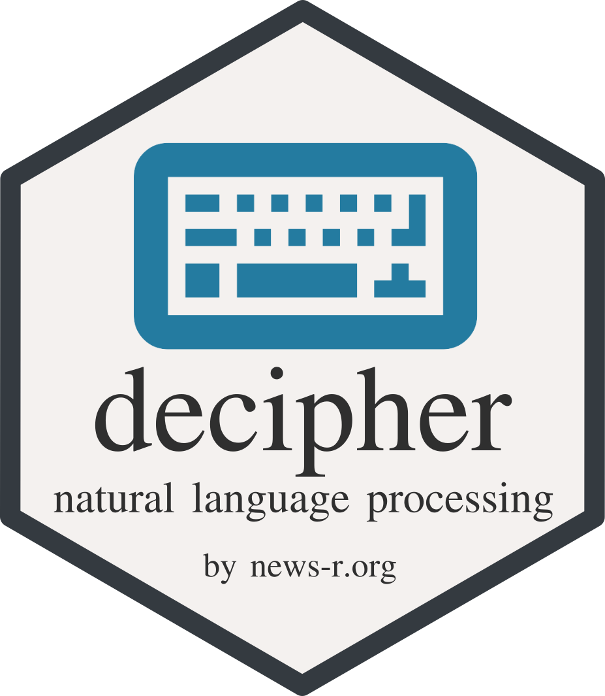

[](https://travis-ci.org/JohnCoene/decipher) [](https://ci.appveyor.com/project/JohnCoene/decipher)

# decipher



[](https://www.tidyverse.org/lifecycle/#experimental) [](https://cran.r-project.org/package=decipher)

Tools to _easily_ develop, build and train Natural Language processing models with [openNLP](https://opennlp.apache.org/) CLI tools from R.

* [Installation](#install)
* [Models](#models)
* [Functions](#functions)
* [Examples](#examples)
    * [Name extraction](#name-extraction)
    * [Document Classification](#document-classification)
* [Guide](#guide)
    * [Name Tagging](#name-tagging)
    * [Training Data](#training-data)

## Install

```r
# install.packages("remotes")
remotes::install_github("JohnCoene/decipher")
```
`decipher` depends on [openNLP](https://opennlp.apache.org/), see the section below.

### Dependencies

#### Mac

Install with [Homebrew](https://brew.sh/), also intall the Java SDK.

```
brew install apache-opennlp
```

#### Windows

This package relies on [openNLP](http://opennlp.apache.org/) CLI tools.

1. [Download](http://opennlp.apache.org/download.html) binary *AND* source files.
2. Unzip both the binary and the source folders.
3. Add `path/to/opennlp/bin` to path and make sure it is in R too with `Sys.getenv("PATH")`.

You're good to go.

## Models

The packages focuses on the training and usage of models but one may also use it for [out-of-the-box](http://opennlp.sourceforge.net/models-1.5/) models.

## Functions

* `dc`: Run Document classifier.
* `dc_train`: Train Document Classifer.
* `tnf`: Learnable Name Finder.
* `tnf_trainer`: Train Learnable Name Finder.
* `get_names`: Get Token Names.
* `nglm`: N-gram language model

helpers:

* `check_tags` Ensure correct OpenNLP Tags.

## Examples

### Name Extraction

__vector__

```r
library(decipher)

# get working directory
# need to pass full path
wd <- getwd()

# Training to find "WEF"
data <- paste("This organisation is called the <START:wef> World Economic Forum <END>",
  "It is often referred to as <START:wef> Davos <END> or the <START:wef> WEF <END> .")

# train the model
model <- tnf_train(model = paste0(wd, "/wef.bin"), lang = "en",
  data = data, type = "wef")

# Create sentences to test our model
sentences <- paste("This sentence mentions the World Economic Forum the annual meeting",
  "of which takes place in Davos. Note that the forum is often shortened to WEF.")

# run model on sentences
results <- tnf(model = model, sentences = sentences)

# get names from results
(names <- get_names(results))
```

__txt files__

```r
# same with .txt files
# Training to find "WEF"
data <- paste("This organisation is called the <START:wef> World Economic Forum <END>", 
  "It is often referred to as <START:wef> Davos <END> or the <START:wef> WEF <END> .")

# Save the above as file
write(data, file = "input.txt")

# Trains the model and returns the full path to the model
model <- tnf_train_(model = paste0(wd, "/wef.bin"), lang = "en",
  data = paste0(wd, "/input.txt"), type = "wef")

# Create sentences to test our model
sentences <- paste("This sentence mentions the World Economic Forum the annual meeting",
  "of which takes place in Davos. Note that the forum is often called the WEF.")

# Save sentences
write(data, file = "sentences.txt")

# Extract names
# Without specifying an output file the extracted names appear in the console
model <- tnf_(model = model, sentences = paste0(wd, "/sentences.txt"))

# returns path to output file
output <- tnf(model = model, sentences = paste0(wd, "/sentences.txt"),
  output = paste0(wd, "/output.txt"))
  
# You can train slightly more sophisticated models too
# Training to find sentiments
data <- paste("This sentence is <START:sentiment.neg> very bad <END> !",
  "This sentence is <START:sentiment.pos> rather good <END> .",
  "This sentence on the other hand, is <START:sentiment.neg> horrible <END> .")

# Save the above as file
write(data, file = "input.txt")

# Trains the model and returns the full path to the model
model <- tnf_train_(model = paste0(wd, "/sentiment.bin"), lang = "en",
  data = paste0(wd, "/input.txt"), type = "sentiment")

# Create sentences to test our model
sentences <- paste("The first half of this sentence is a bad and negative while",
  "the second half is great and positive.")

# Save sentences
write(data, file = "sentences.txt")

# Extract names
# Without specifying an output file the extracted names appear in the console
tnf_(model = model, sentences = paste0(wd, "/sentences.txt"))
```

### Document Classification

```r
library(decipher)

# Classification
# create dummy data
data <- data.frame(class = c("Sport", "Business", "Sport", "Sport"),
  doc = c("Football, tennis, golf and, bowling and, score",
          "Marketing, Finance, Legal and, Administration",
          "Tennis, Ski, Golf and, gym and, match",
          "football, climbing and gym"))

# repeat data 50 times to have enough data
# Obviously do not do that in te real world
data <- do.call("rbind", replicate(50, data, simplify = FALSE))

# train model
model <- dc_train(model = paste0(wd, "/model.bin"), data = data, lang = "en")

# create documents to classify
documents <- data.frame(
  docs = c("This discusses golf which is a sport.",
           "This documents is about business administration.",
           "This is about people who do sport, go to the gym and play tennis.",
           "Some play tennis and work in Finance")
)

# classify documents
classified <- dc(model, documents)
cat(classified)
```

## Guide

### Name Tagging

* `<END>.` is *invalid*
* `<END> .` is *valid*

Use `check_tags` to make sure they are correct.

### Tagger

A *currently* basic tagger to easily tag training data to train a token name finder (`tnf_train`).

```r
# Manually tagged
manual <- paste("This organisation is called the <START:wef> World Economic Forum <END>",
              "It is often referred to as <START:wef> Davos <END> or the <START:wef> WEF <END> .")

# Create untagged string              
data <- paste("This organisation is called the World Economic Forum",
  "It is often referred to as Davos or the WEF.")

# tag string
auto <- tag_docs(data, "WEF", "wef")
auto <- tag_docs(auto, "World Economic Forum", "wef")
auto <- tag_docs(auto, "Davos", "wef")

identical(manual, auto)
```

### Training data

#### Token name finder

You will need considerable training data for the name extraction; 15'000 sentences. However, this does not mean 15'000 tagged sentences, this means 15'000 sentences representative of the documents you will have to extract names from.

Including sentences that do not contain tagged names reduces false positives; *the model learns what to extract as much as it learns what not to extract.*

#### Document classifier

In order to train a decent document classifier you are going to need 5'000 classified documents as training data with a *bare* minimum of 5 documents per category.

```r
library(decipher)

# get working directory
# need to pass full path
wd <- getwd()

data <- data.frame(
  class = c("Sport", "Business", "Sport", "Sport", "Business", "Politics", "Politics", "Politics"),
  doc = c("Football, tennis, golf and, bowling and, score.",
          "Marketing, Finance, Legal and, Administration.",
          "Tennis, Ski, Golf and, gym and, match.",
          "football, climbing and gym.",
          "Marketing, Business, Money and, Management.",
          "This document talks politics and Donal Trump.",
          "Donald Trump is the President of the US, sadly.",
          "Article about politics and president Trump.")
)

# Error not enough data
model <- dc_train(model = paste0(wd, "/model.bin"), data = data, lang = "en")

Sys.sleep(15)

# repeat data 50 times
# Obviously do not do that in te real world
data <- do.call("rbind", replicate(50, data[sample(nrow(data), 4),],
                                   simplify = FALSE))

# train model
model <- dc_train(model = paste0(wd, "/model.bin"), data = data, lang = "en")
```
